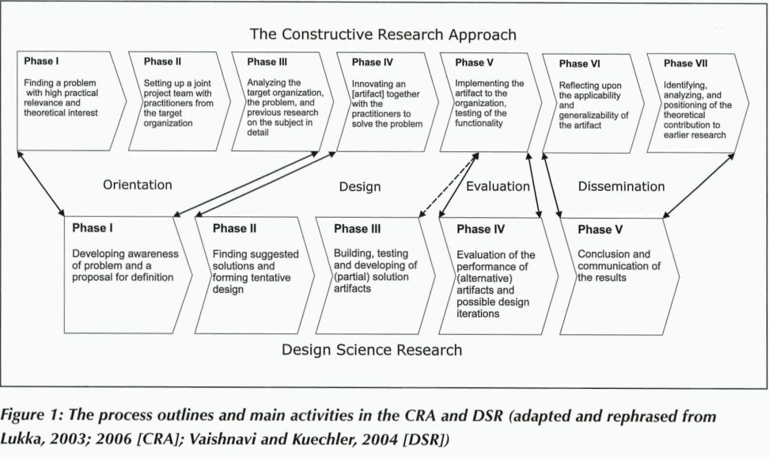

# Readings

## Constructive Synergy in Design Science Research (2013)

PIIRAINEN KA, GONZALEZ RA. Constructive Synergy in Design Science Research: A Comparative Analysis of Design Science Research and the Constructive Research Approach. Liiketaloudellinen Aikakauskirja. 2013;(3/4):206-234. Accessed July 15, 2021. [EBSCOHost](https://search.ebscohost.com/login.aspx?direct=true&AuthType=ip,shib&db=bth&AN=95116694&site=eds-live). [Synergy.pdf](Synergy.pdf).

> Based on the cited sources, it would seem that the objective of DSR is similar to that of CRA, but DSR approaches the task of problem solving with a different trajectory. The basic position in DSR seems to be more oriented toward design driven by, on one hand, use of existing theory to solve problems and, on the other, validation or development of new theories based on the experiences. Especially the earlier authors clearly prescribe the explicit use of a kernel theory as the core of the design (e.g. Walls et al. 1992; Markus et al. 2002), while CRA literature does not explicitly demand that the design would be based on a specific theory.
> Nevertheless, CRA does not reject the use of a kernel theory as for example Kekäle (2001) discusses the sources of solutions in CRA and proposes that the artifact may be based, among other things, on a theory. An theory driven example of CRA is presented by Kasanen et al. (1993, p. 247) where one of the authors developed a model for capital budgeting using the value maximizing paradigm and a specific budgeting framework. The artifact one of the authors developed to solve a budgeting problem was based on a rather clear kernel theory; it was tested with simulations and then implemented as an instantiation to verify the utility (pg. 216).

## A Critical Look at Theories in Design Science Research (2020)

Iivari, Juhani. 2020. "Editorial: A Critical Look at Theories in Design Science Research." Journal of the Association for Information Systems 21 (3): 502–19. doi:10.17705/1jais.00610. [CriticalLook.pdf](CriticalLook.pdf).
